# AccuKnox v3.3 Release Notes

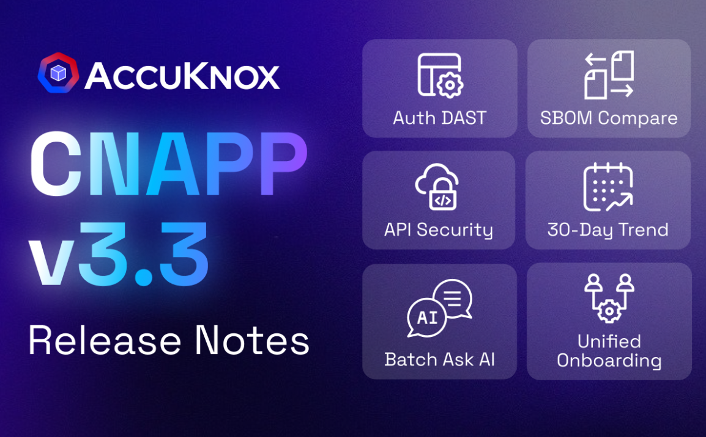

AccuKnox v3.3 expands the platform's depth with a focus on operational efficiency and extended coverage.

* This release moves beyond snapshot visibility by introducing 30-day historical trend data across all dashboards.
* We have improved our API Security offering with native AWS API Gateway integration and introduced authenticated DAST scanning to ensure protected endpoints are fully tested.
* Workflows are now faster with Unified Onboarding for image scanning and a new Batch Ask AI feature that allows teams to remediate findings in bulk.
* Experience improved data management with a centralized File Manager for exports and expanded our ecosystem support to include OCI, Red Hat OpenShift, and major SCA providers like GitHub and GitLab.

## API Security and AWS API Gateway Integration

We have expanded API Security capabilities to include AWS API Gateway support. Users can now enable log forwarding on existing API Gateway stages. A provided stack set connects logs to the discovery engine, creating a real-time inventory of API endpoints.

The system categorizes traffic into sensitive, external, and internal flows. Users can upload OpenAPI specifications directly or via scan to compare actual traffic against defined specs. This comparison highlights Shadow APIs, Orphan APIs, and Active APIs. Findings include request/response details and sensitive data exposure.

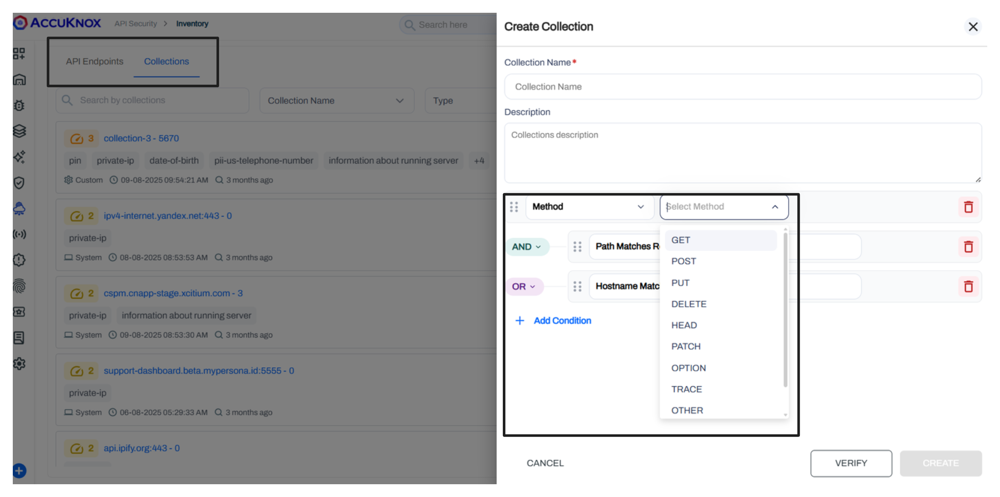
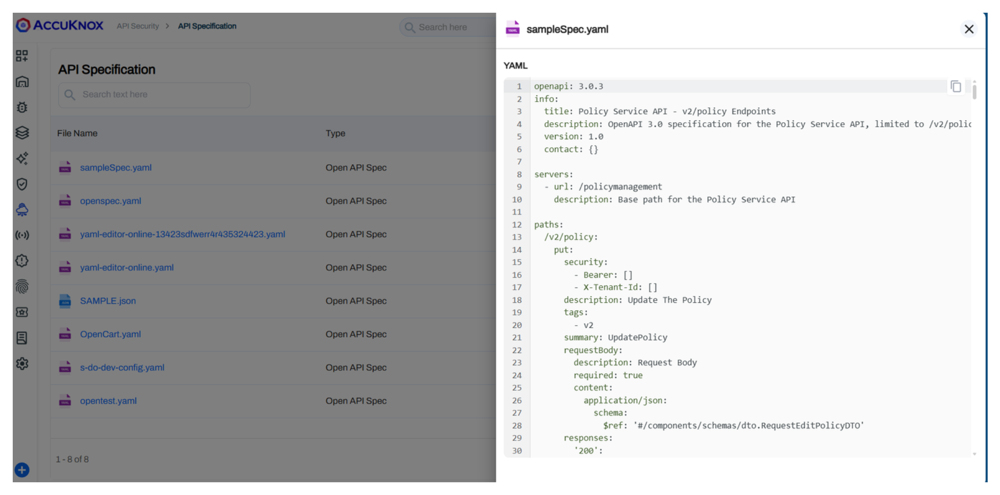
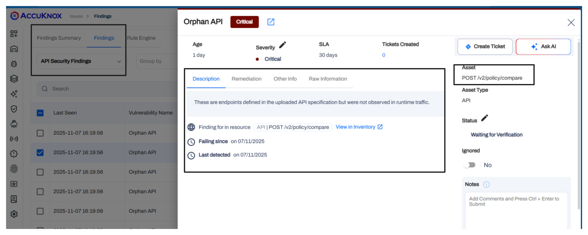

## Authenticated DAST Scans

Dynamic Application Security Testing (DAST) now supports authenticated scans. Users can toggle between authenticated and unauthenticated modes. The system supports username and password inputs and visualizes the scan state with "Logged In," "Logged Out," and "Fallback" indicators.

This prevents false negatives where crawlers fail to access protected content. Users define specific text strings that appear on logged-in pages. This allows the scanner to verify authentication success.

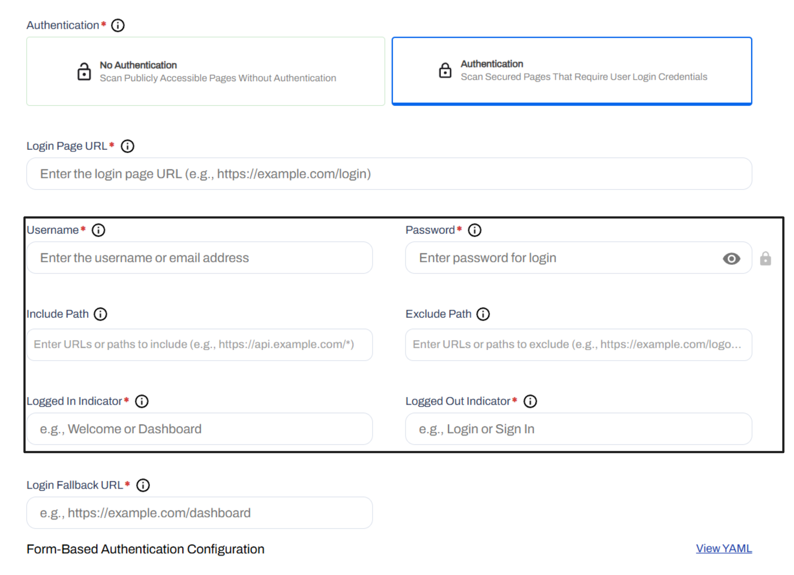

## SBOM Comparison Project

We added a comparison utility for Software Bill of Materials (SBOM). Users can upload CycloneDX JSON files into a project and select two versions to compare.

The interface highlights added packages, removed packages, and version changes between the two files. This aids in tracking dependency drift and supply chain changes over time.

## Unified Onboarding and Image Scanning

In-cluster image scanning is now integrated directly into the onboarding flow. Previously, this required separate agents and manual commands.

For Kubernetes, the onboarding Helm command now includes a toggle to enable image scanning immediately. For VMs, scanning remains command-based but feeds into the unified control plane.

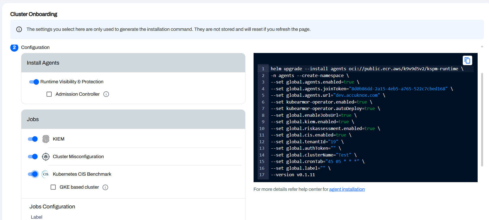

## Extended Trend Data and New VM Widgets

Dashboard trend widgets now display 30 days of historical data. This replaces the previous 3-4 day view. It provides a usable timeline for security posture analysis.

We also added 8 new VM-related widgets to the configurable dashboard library for better visualization of virtual machine vulnerabilities.

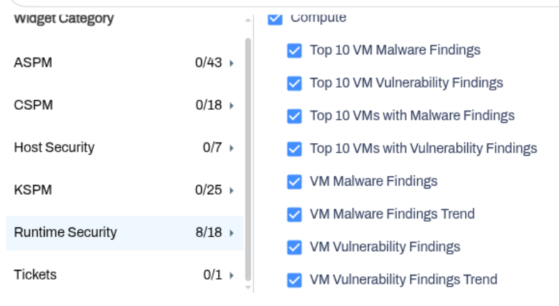

## File Manager and Export Options

Exports are no longer restricted to email delivery. A new File Manager section acts as a central download hub.

When generating reports for Assets, Findings, CSPM, or ASPM, users can choose delivery via Email, File Manager, or both. The File Manager auto-tags exports by product line and creates clear naming conventions for easy retrieval.

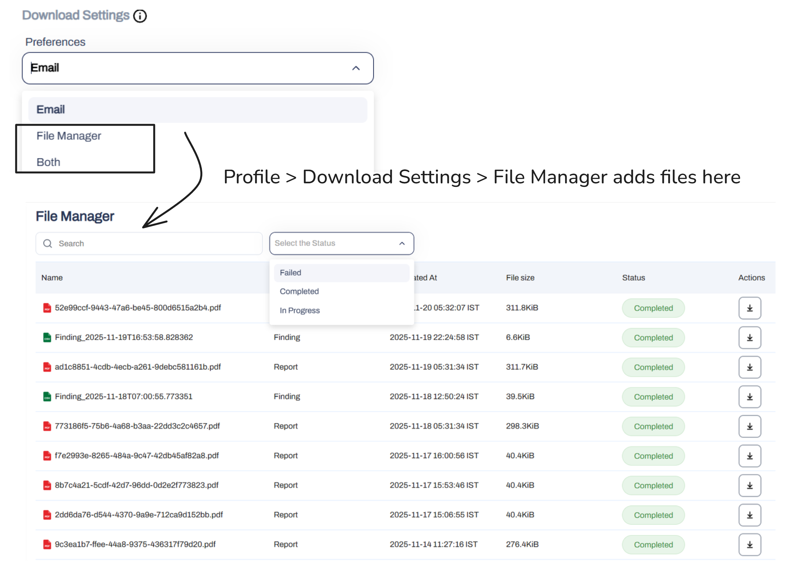

## Batch Ask AI Remediation

The "Ask AI" remediation feature now supports batch operations. Users can group multiple findings or assets and request remediation guidance for the entire set at once. This removes the need to trigger AI assistance individually for related alerts.

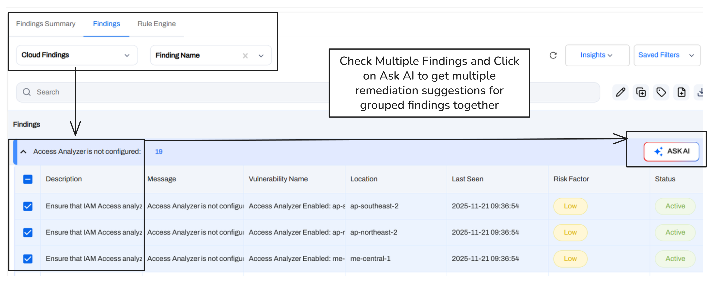

## Smart Tickets

Ticket creation for grouped findings now follows an Epic-like structure. When a user generates a ticket from a finding group, the system creates a parent ticket for the group context and individual child tickets for specific findings.

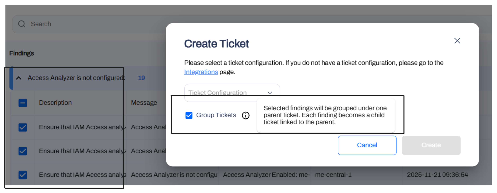

## Token Expiry Notifications

We implemented proactive alerts for token management. API and artifact tokens now trigger email notifications at 5 days, 3 days, and 1 day prior to expiration. A final alert is sent post-expiry.

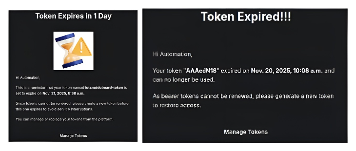

## SCA (Software Composition Analysis) Findings with EPSS Scores

We added support for GitHub, GitLab, and Bitbucket. Users can connect public or private repositories and **select specific branches or tags for scanning**. Findings are reported under Software Composition Analysis (SCA). EPSS scores are calculated and stored in AccuKnox's internal VMDB and shown as columnar values for Software Composition Analysis findings.

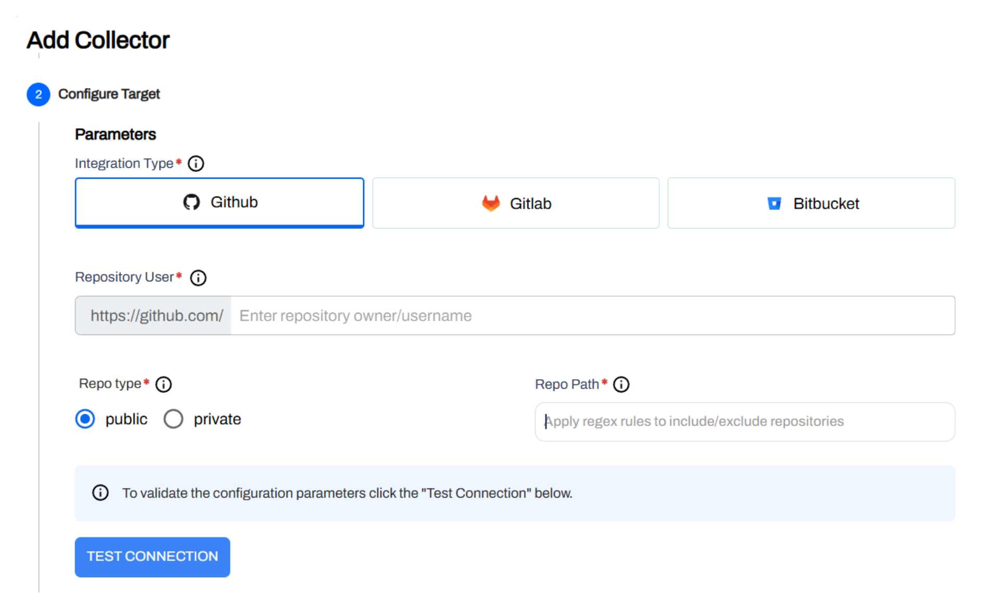
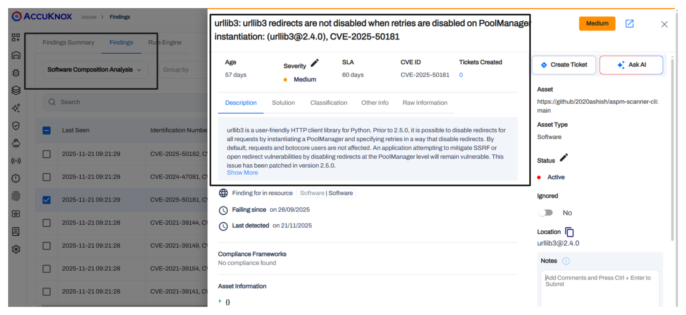

## OCI Support

Oracle Cloud Infrastructure (OCI) is now supported for compliance scanning and asset visibility. After onboarding, view findings under Issues → Cloud Findings → Cloud Scan by selecting your Oracle account. OCI-specific widgets are available on the Dashboard, and compliance benchmarks can be managed in the Compliance section.

**Read the detailed docs:** [Oracle Cloud Infrastructure (OCI) Integration](https://help.accuknox.com/how-to/oracle-onboarding/).

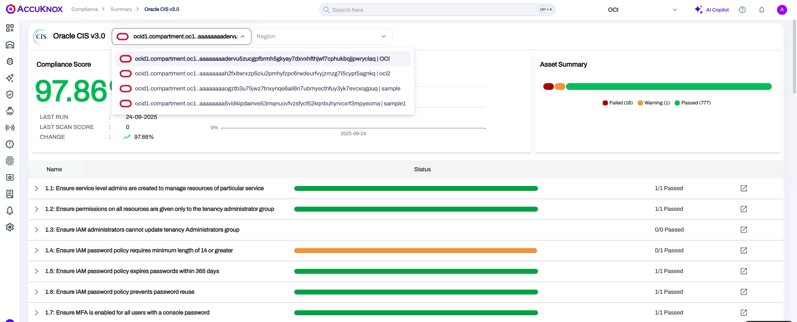
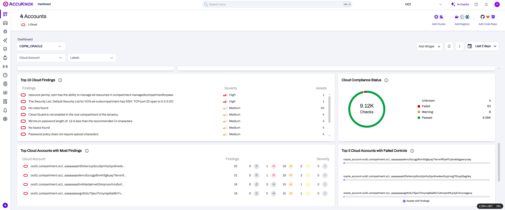

## Red Hat OpenShift Support

We introduced scripts designed specifically for OpenShift clusters. These scripts populate the control plane with generic VM vulnerability data. Findings are categorized under the VM vulnerability section without strictly differentiating between Windows or Linux subtypes.

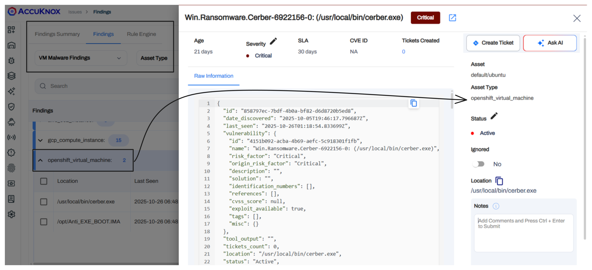

## Malware Data Type

"Malware" is now a distinct data type separate from general vulnerabilities. This classification includes OS-type context (Windows or Linux) to help prioritize threats specifically related to malicious software presence.

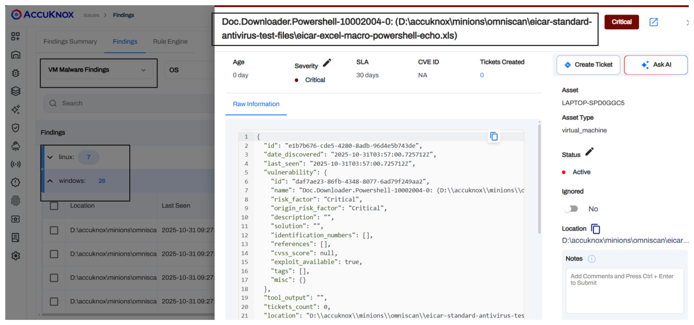

## VMDB Vulnerability Enrichment

Trivy-based findings now pull context from the AccuKnox internal VMDB. This enriches vulnerability reports with fields like EPSS scores and percentiles. This data applies specifically to Trivy-based scans.

## Save-as-Filter in Findings

Users can now save custom filter configurations directly on the Findings page. These filters persist and apply across different finding categories. This allows users to quickly return to specific views without rebuilding complex query logic.

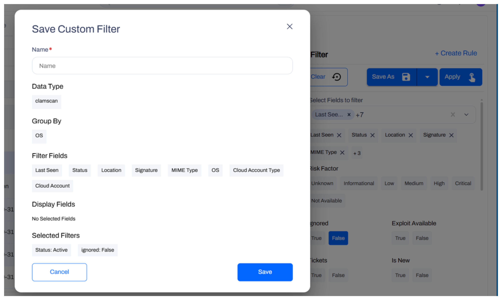

## Audit Trail Logs (EventTrail)

A functional audit log is now available. It tracks creation, access, and updates to system items. This provides necessary visibility for governance, compliance, and troubleshooting user actions.

**Check the detailed docs**: [Audit Trail Logs (EventTrail)](https://help.accuknox.com/getting-started/audit-trail-logs/).

## Takeaways

This release represents a significant step forward in operational flexibility and coverage. By integrating expanded OCI support, generic OpenShift scanning, and centralized file management, v3.3 empowers teams to manage diverse environments with precision. These updates are now live and available in your AccuKnox dashboard.