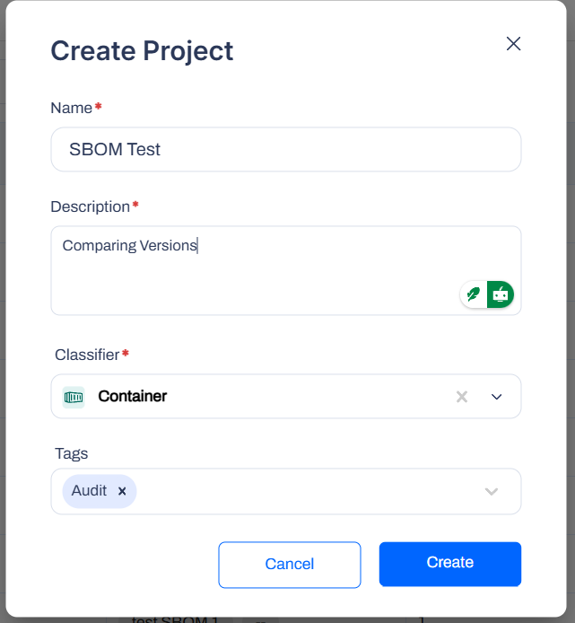
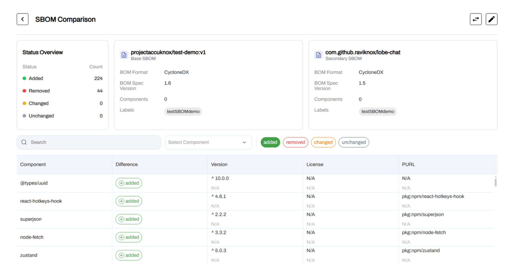

# SBOM Overview
This guide outlines how to onboard and use SBOMs in AccuKnox: generate an SBOM, upload or automate its ingestion, let the system scan and analyze dependencies, then view, compare, and report on results. Prerequisites: ability to generate SBOMs in a standard format and upload or automate their ingestion.

## Version Compatibility Utility

The SBOM Compare feature allows developers to analyze differences between two SBOMs, helping identify changes in dependencies that may introduce new risks or vulnerabilities.

We added a comparison utility for Software Bill of Materials (SBOM). Users can upload CycloneDX JSON files into a project and select two versions to compare.

The interface highlights added packages, removed packages, and version changes between the two files. This aids in tracking dependency drift and supply chain changes over time.

