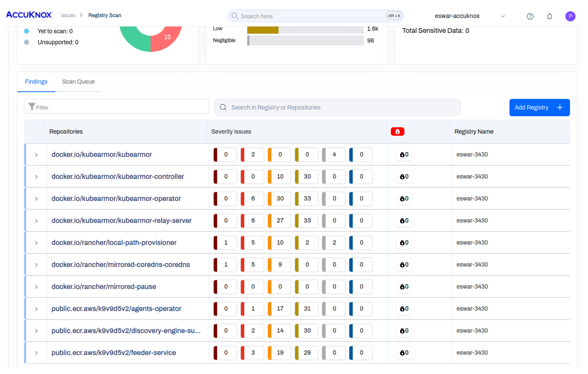

# Container Image Scanning on Virtual Machines (Agent-Based)

## Pre-Requisites

[**Knoxctl**](https://help.accuknox.com/knoxctl/) must be installed. 

### Command for installing

```bash
curl -sfL https://knoxctl-cli.s3.us-east-2.amazonaws.com/install.sh | sudo sh -s -- -b /usr/local/bin
```

## Scanning Running Containers

Run the following command to scan running containers:

```bash
sudo knoxctl image-scan --artifactEndpoint=cspm.dev.accuknox.com --label=checkmarx --token=""
```

Once images are scanned, the results can be viewed in the findings page.

