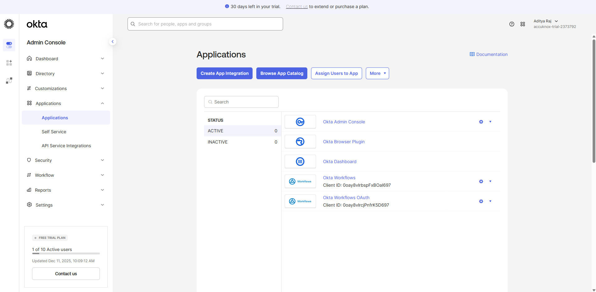
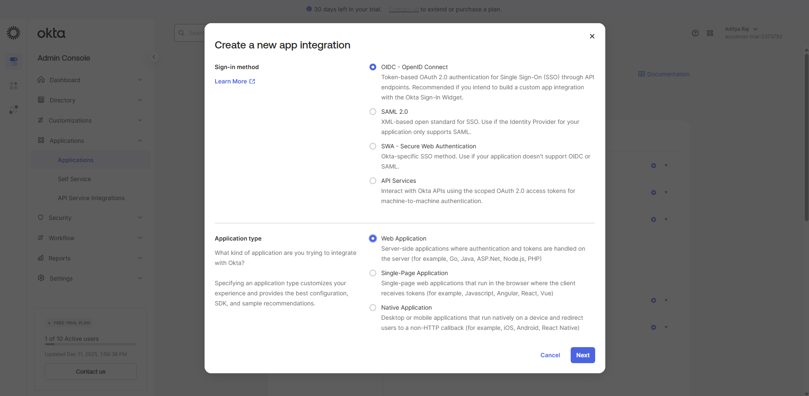
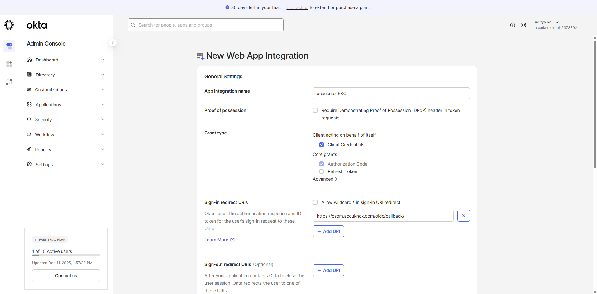
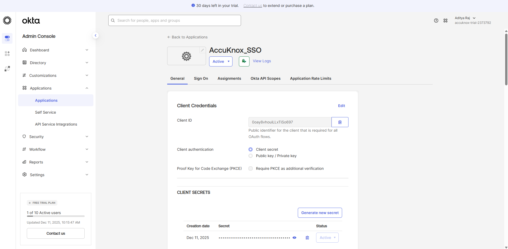
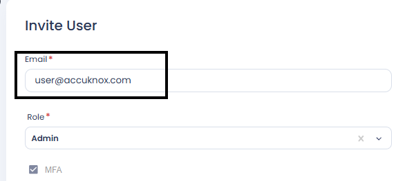
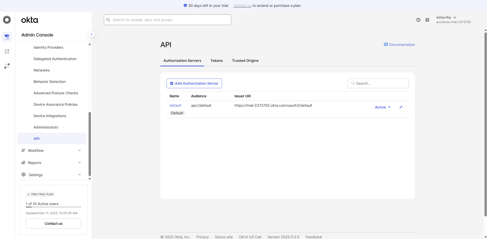
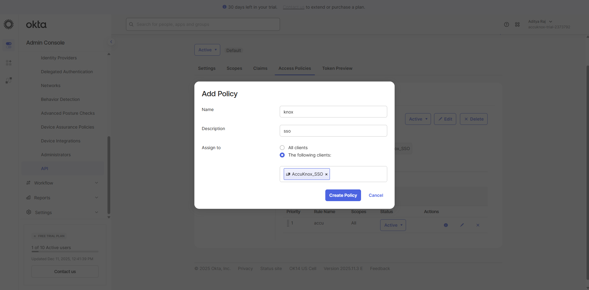
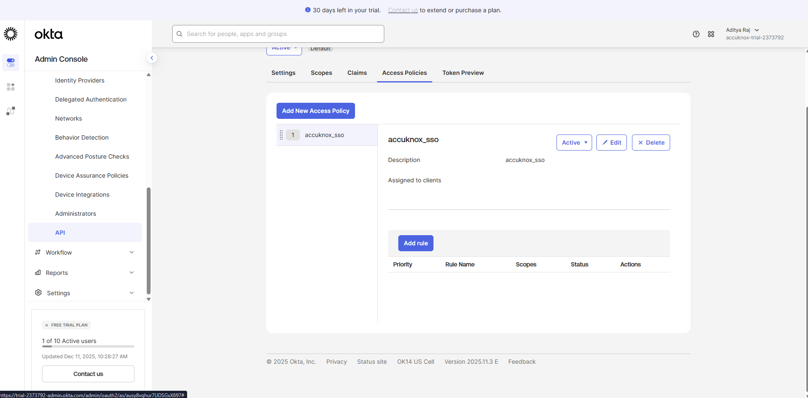
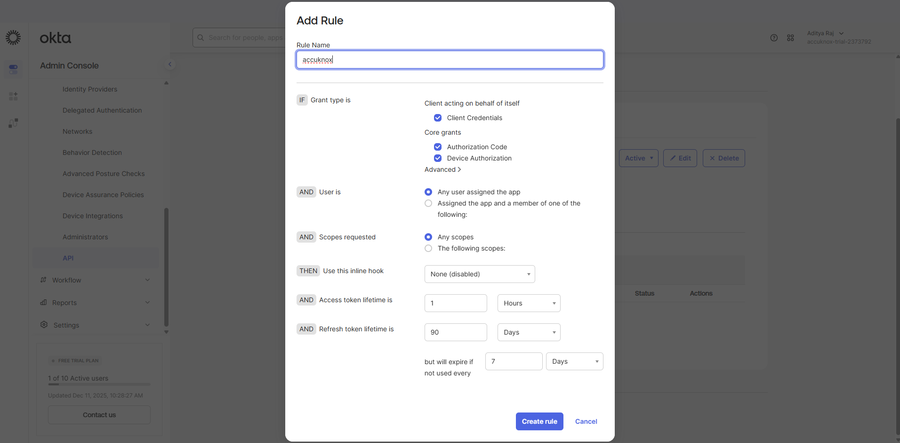
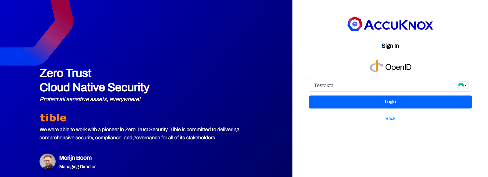

# Okta SSO with AccuKnox

This guide helps you integrate **Okta** with **AccuKnox** using **OpenID Connect (OIDC)** for Single Sign-On (SSO).

## Prerequisites

- Okta account with admin access.
- Access to AccuKnox Tenant for user invitation

## 1. Create Okta Application Integration

1. Sign in to your [**Okta Dashboard**](https://developer.okta.com/admin/dashboard/).
2. Navigate to **Applications > Applications**.

3. Create a new **App integration** → Select **OIDC**.

4. **App Integration Settings**:
    - **App integration name**: Any meaningful name (e.g., `AccuKnox SSO`).
    - **Sign-in redirect URIs**: Enter: `https://cspm.accuknox.com/oidc/callback/`

5. Enable **Client Credentials** (leave other fields as default).
6. Click **Save**.

## 2. Gather Required Information

Once the application is created, you will be on the application's **General** tab. You need to collect specific details to complete the setup with AccuKnox.

- Copy the **Domain** (from **Security → API → Issue URI**).
- Copy the **Client ID**.
- Copy the **Client Secret**.

!!! info "Provide Details to AccuKnox"
    === "SaaS Users"
        - Share the **Client ID**, **Client Secret**, and **Okta Domain** securely with the AccuKnox support team.
        - The team will configure the OIDC backend for your organization.

    === "On-Premise Users"
        - You can directly input the configuration into your admin portal.
        - Here is a sample configuration using your Okta details:
        

## 3. Provide API Permission

1. Navigate to **Security → API** in Okta.

2. Click on the **Authorization Server (default)** → **Access Policies**.
3. **Add a policy**:
    - Enter a **Name** and **Assign to**.
    - **Select the following clients**: provide the **Client_ID** of the application created in **Step 1**.
    
4. Click **Create Policy**.
5. Click **Add Rule**.

6. Provide a **Rule name** and leave other fields as default.

7. Create rule.
8. **Send the following to AccuKnox (for BE configuration)**:
    - **Client ID**
    - **Client Secret**
    - **URL (Domain / Issue URI)**

## 4. Invite Okta Users to AccuKnox

1. Log in to the **AccuKnox SaaS console**.
2. Go to **User Management > Invite User**.
3. Enter the **email address** of the user along with other details and send the invite.

!!! info "Note"
    Ensure the invited Okta user has their **email field filled in** within their Okta profile. The email must **exactly match** the one used during the AccuKnox invitation.

## 5. Logging in to AccuKnox via Okta SSO

1. Navigate to the [AccuKnox Login Page](https://cspm.demo.accuknox.com/).
2. Click **OpenID**.
3. Enter your **organization name**.

4. You will be redirected to Okta. Sign in using your **Okta credentials**.
5. Upon successful authentication, you will be logged into the AccuKnox dashboard.

